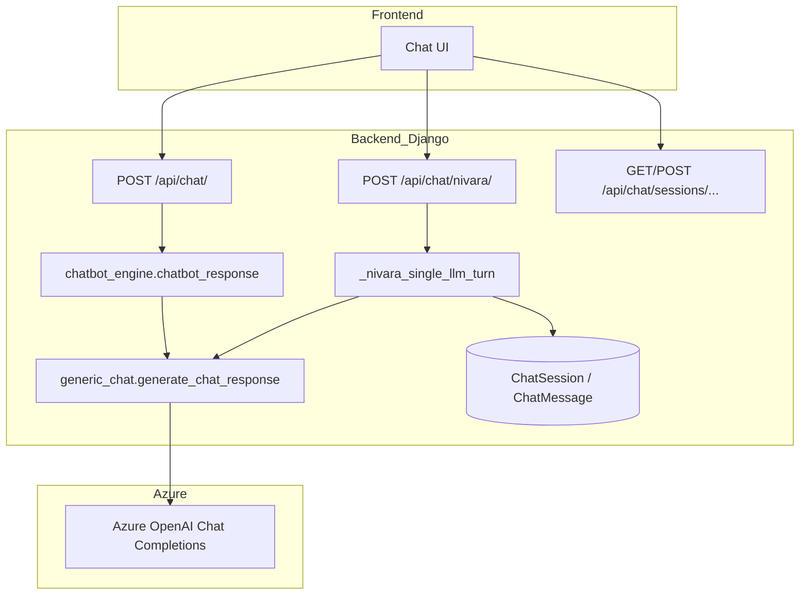
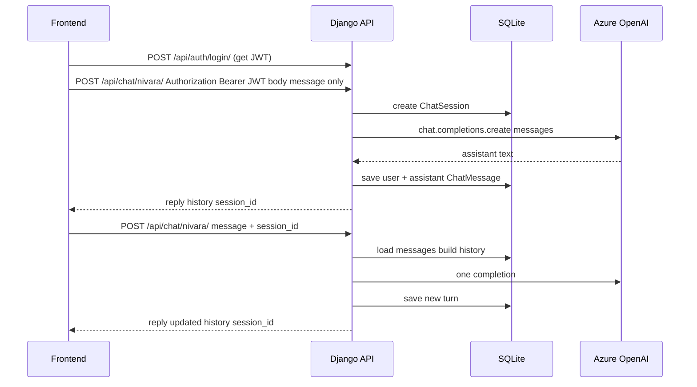

# Nivara — Chatbot & LLM Integration Workflow

This document describes **how the conversational chatbot works**, **where Azure OpenAI is used**, **how requests flow from the frontend to the LLM**, and **which HTTP endpoints** your React (or other) client should call. It also briefly separates **chat** from **other LLM features** (lifestyle, report, mood insights) so the overall project picture stays clear.

---

## 1. URL layout (how paths compose)

| Layer | Prefix | Example |
|--------|--------|---------|
| Django root (`NIVARA/urls.py`) | `api/` includes `nivara_app.urls` | — |
| App routes (`nivara_app/urls.py`) | `chat/`, `report/summary/`, … | — |
| **Full path** | | `http://<host>/api/chat/nivara/` |

**Note:** `report/summary/` and `report/summary/export/` are also registered **directly** on the project `urls.py` as `api/report/summary/` (same effective URL as `api/` + include would allow—your app uses the explicit project-level paths for those two).

---

## 2. Big picture: two “chat” surfaces vs other LLM features



| Feature | Module | Endpoint(s) | LLM calls per user action |
|--------|--------|-------------|---------------------------|
| **Legacy single-turn chat** | `chatbot_engine.py` → `generic_chat.py` | `POST /api/chat/` | **1** |
| **Nivara chat (history)** | `views.py` → `generic_chat.py` | `POST /api/chat/nivara/` | **1** |
| **Session list / create** | `views.py` (no LLM) | `GET/POST /api/chat/sessions/` | **0** |
| **Load one conversation** | `views.py` (no LLM) | `GET /api/chat/sessions/<id>/` | **0** |
| **Lifestyle + report bundle** | `analysis.py` | `GET .../lifestyle/recommendations/`, `GET .../report/summary/`, etc. | **0–1** (cached) |
| **Mood insights (analysis schema)** | `analysis.py` | `GET /api/mood/insights-ai/` | **0–1** (cached) |

The rest of this document focuses on **chat**; section 12 summarizes **other LLM** usage.

---

## 3. Core LLM engine: `nivara_app/ai_engine/generic_chat.py`

### 3.1 Role

- Configures the **Azure OpenAI** client (`openai.AzureOpenAI`).
- Defines **system prompt** (`SYSTEM_PROMPT`) for the “Nivara” wellness persona.
- Exposes **`generate_chat_response(history_list, current_query) → str`**: the **only** place that calls the chat completion API for conversational text.

### 3.2 Environment variables (`.env`)

| Variable | Purpose |
|----------|---------|
| `AZURE_OPENAI_API_KEY` | Azure API key |
| `AZURE_OPENAI_ENDPOINT` | e.g. `https://<resource>.openai.azure.com/` |
| `AZURE_OPENAI_CHAT_DEPLOYMENT` | Deployment name (must match Azure portal) |
| `AZURE_OPENAI_API_VERSION` | API version (default `2024-02-15-preview` in code if unset) |

If `AZURE_OPENAI_CHAT_DEPLOYMENT` is missing, importing `generic_chat` **raises** `ValueError` at startup.

### 3.3 Single API call per message (cost model)

Inside `generate_chat_response`:

1. Validates and truncates the user message (`MAX_INPUT_CHARS = 1500`).
2. Keeps only the last **`MAX_HISTORY_TURNS = 8`** turns (each turn = user + assistant pair conceptually in the list you pass).
3. Builds `messages` for the API:
   - `[{ role: system, content: SYSTEM_PROMPT }, ...history as user/assistant pairs..., { role: user, content: current_query }]`
4. Calls **`client.chat.completions.create`** once:
   - `model=DEPLOYMENT_NAME`
   - `temperature=0.7`
   - `max_tokens=400`
   - `timeout=20`
5. Retries up to **`MAX_RETRIES = 3`** with exponential backoff on failure.
6. **Safety guard:** if the model reply contains certain **medical trigger words**, a short disclaimer is appended encouraging professional care.

**There is no second LLM call** for the same user message (no tool chains, no self-correction loop).

### 3.4 Optional in-process helper: `NivaraChat` class

Same file provides `NivaraChat` for **local Python testing** (`if __name__ == "__main__"`): it keeps `history` in memory and calls `generate_chat_response`. The **production web app** does not use this class; it uses Django views + DB or client-sent history.

---

## 4. Thin legacy wrapper: `nivara_app/ai_engine/chatbot_engine.py`

- **`chatbot_response(user_message: str)`**  
  - Imports **`generate_chat_response([], user_message)`** (empty history = single turn).  
  - Passes the result through **`compact_assistant_reply`** from `chat_formatting.py`.  
  - On any exception, returns a generic “temporarily unavailable” string.

Used only by **`POST /api/chat/`**.

---

## 5. Response formatting: `nivara_app/chat_formatting.py`

- **`compact_assistant_reply(text)`**  
  - Collapses repeated blank lines in the model output so the UI doesn’t show huge gaps.  
  - Skips processing if the text looks like an `[Error...]` message.

Applied to Nivara chat replies after `generate_chat_response` in **`_nivara_single_llm_turn`**, and in **`chatbot_response`** for the legacy endpoint.

---

## 6. Django models (`models.py`) — chat tables

Chat persistence is defined in **`nivara_app/models.py`** (see the block commented *“CHAT SESSIONS”*). Django maps each model to a real SQL table via `Meta.db_table`.

### 6.1 `ChatSession`

| Attribute | Type | Meaning |
|-----------|------|---------|
| `user` | `ForeignKey` → `User` | Owner of the thread; `on_delete=CASCADE` deletes sessions if the user is deleted. |
| `title` | `CharField(max_length=200)` | Short label for the UI (first user message is copied here on first save, truncated). |
| `created_at` | `DateTimeField(auto_now_add=True)` | When the session row was created. |
| `updated_at` | `DateTimeField(auto_now=True)` | Bumped when the view saves new messages. |

**`Meta`:** `db_table = "chat_sessions"`, default ordering `-updated_at` (newest threads first in lists).

### 6.2 `ChatMessage`

| Attribute | Type | Meaning |
|-----------|------|---------|
| `session` | `ForeignKey` → `ChatSession` | Thread this line belongs to; `related_name="messages"`. |
| `role` | `CharField(choices=…)` | `"user"` or `"assistant"` only. |
| `content` | `TextField` | Raw message text from the user or from the LLM (after `compact_assistant_reply`). |
| `created_at` | `DateTimeField(auto_now_add=True)` | Insert time. |

**`Meta`:** `db_table = "chat_messages"`, ordering `created_at`, `id` so messages replay in order.

**Relationship:** one `ChatSession` has many `ChatMessage` rows. The view always writes **two** rows per successful turn: user message, then assistant message.

### 6.3 How the tables were created (migrations)

Tables are **not** created by hand in SQL. They come from Django migrations:

- **File:** `nivara_app/migrations/0007_chat_sessions.py`  
- **Operations:** `CreateModel` for `ChatSession`, then `CreateModel` for `ChatMessage` with `ForeignKey` to `ChatSession`.  
- **Dependency:** `0006_phase7_doctor_consultation`.

After pulling the code, anyone runs:

```bash
python manage.py migrate
```

which applies `0007` and creates **`chat_sessions`** and **`chat_messages`** in SQLite (or your configured DB).

### 6.4 Writes and SQLite locking

Session creation and message inserts from **`_nivara_single_llm_turn`** (and session **POST**) use **`sqlite_write()`** in **`nivara_app/db_retry.py`** so concurrent requests are less likely to hit “database is locked” on SQLite. That does not change the schema; it only wraps ORM writes.

---

## 7. Serializers (`serializers.py`) — chat

**There are no DRF serializers for chat in this project.**  
`grep` over `nivara_app/serializers.py` shows **no** `ChatSessionSerializer`, `ChatMessageSerializer`, or chat-related classes.

**Why:** the chat views build **plain Python dicts** and return them with `Response({...})`. Inputs are read with `request.data.get("message")`, `request.data.get("session_id")`, `request.data.get("history")` and validated inline (type checks, `int(session_id)`, empty message → 400).

**Implication for you:** if you want OpenAPI-style validation, nested serializers, or automatic field docs, you could later add serializers; today everything is **explicit in `views.py`**.

---

## 8. `views.py` — which code does what (detailed)

All symbols below live in **`nivara_app/views.py`** (line numbers are approximate; use search in the file if they drift).

| Lines (approx.) | Function / class | Responsibility |
|-----------------|------------------|----------------|
| **1476–1490** | `_chat_history_turns_from_db(session, max_turns=8)` | Loads `ChatMessage` rows for that session, keeps the last `max_turns * 2` messages, walks pairs `(user, assistant)` and builds the list format `generic_chat` expects: `[{"human_msg": "...", "ai_msg": "..."}, ...]`. Caps turns with `MAX_HISTORY_TURNS` from `generic_chat`. |
| **1493–1577** | `_nivara_single_llm_turn(request, message)` | **Core orchestrator** for Nivara chat: (1) lazy-imports `generate_chat_response` and handles missing `openai` with 503; (2) validates non-empty `message`; (3) resolves **session**: new `ChatSession` for authenticated user without `session_id`, or loads existing by `session_id`, or uses guest `history` from JSON body; (4) calls **`generate_chat_response(history, message)`** → **one** Azure call; (5) runs **`compact_assistant_reply`**; (6) if DB session and no error prefix, **`sqlite_write`** saves two `ChatMessage` rows and updates session `title`/`updated_at`; (7) returns JSON `reply`, `history`, and `session_id` when using DB. |
| **1460–1467** | `chat_with_ai` | **`POST /api/chat/`**. `AllowAny`. Reads `message`, calls **`chatbot_response`** (legacy engine), returns `{"response": ...}`. No DB, no session. |
| **1580–1590** | `chat_nivara` | **`POST /api/chat/nivara/`**. `AllowAny`. Thin wrapper: passes `request.data.get("message")` into **`_nivara_single_llm_turn`**. |
| **1593–1626** | `ChatSessionsView` | **`GET/POST /api/chat/sessions/`**. `IsAuthenticated`. **GET:** lists up to 100 sessions for `request.user` as dicts (`id`, `title`, timestamps). **POST:** creates empty `ChatSession` via `sqlite_write`, returns `session_id`. **No LLM.** |
| **1629–1654** | `ChatSessionDetailView` | **`GET /api/chat/sessions/<session_id>/`**. `IsAuthenticated`. Loads session + all messages ordered by `id`, returns `messages` as `{role, content, created_at}`. **No LLM.** |

### 8.1 Imports used only for chat (in `views.py`)

- **`ChatSession`, `ChatMessage`** from `.models`  
- **`chatbot_response`** from `.ai_engine.chatbot_engine`  
- **`sqlite_write`** from `.db_retry` (writes after LLM success / session create)  
- Inside helpers: **`generate_chat_response`**, **`MAX_HISTORY_TURNS`** from `.ai_engine.generic_chat`; **`compact_assistant_reply`** from `.chat_formatting`

---

## 9. Django views: chat HTTP API (quick reference)

All paths below assume base **`/api/`** (see section 1).

### 9.1 `POST /api/chat/` — legacy, anonymous-friendly

| Item | Detail |
|------|--------|
| **View** | `chat_with_ai` |
| **Permission** | `AllowAny` |
| **Body** | `{ "message": "<user text>" }` |
| **Flow** | `chatbot_response` → `generate_chat_response([], message)` → **1 Azure call** |
| **Response** | `{ "response": "<assistant text>" }` |
| **History** | None (stateless). |

**Frontend use:** simplest integration; no JWT, no session id. Not ideal for multi-turn memory unless the client resends context (not supported by this endpoint).

---

### 9.2 `POST /api/chat/nivara/` — main Nivara chat (recommended)

| Item | Detail |
|------|--------|
| **View** | `chat_nivara` → `_nivara_single_llm_turn` |
| **Permission** | `AllowAny` (works for guests **and** logged-in users) |
| **Body (typical)** | `{ "message": "<user text>", ... }` (see modes below) |
| **Flow** | Build `history` → `generate_chat_response(history, message)` → **1 Azure call** → `compact_assistant_reply` → optionally save to DB |
| **Response** | `{ "reply": "...", "history": [ { "human_msg", "ai_msg" }, ... ] }` and, when using DB, `{ "session_id": <int>, ... }` |

#### Mode A — **Logged-in user** (JWT), **no `session_id` in body**

- Creates a **new** `ChatSession` for that user (via `sqlite_write`).
- `history` starts empty.
- Response includes **`session_id`** for follow-up messages.

#### Mode B — **Logged-in user** + **`session_id`**

- Loads session; builds `history` from **`ChatMessage`** rows via `_chat_history_turns_from_db` (pairs user+assistant, capped by `MAX_HISTORY_TURNS`).
- Appends new user + assistant messages after a successful reply.

#### Mode C — **Guest** (not authenticated)

- **`history`** must be sent in the body as a list of `{ "human_msg", "ai_msg" }` objects.
- No `session_id`; persistence is **client-side only** (client must send updated `history` each time).

#### Error handling

- If `openai` is not installed, may return **503** with install hint.
- Empty `message` → **400**.
- Invalid / missing session for logged-in user → **404** / **400** as applicable.

---

### 9.3 `GET /api/chat/sessions/` — list sessions (auth only)

| Item | Detail |
|------|--------|
| **View** | `ChatSessionsView.get` |
| **Permission** | `IsAuthenticated` |
| **LLM** | None |
| **Response** | `{ "count", "sessions": [ { id, title, updated_at, created_at } ] }` |

---

### 9.4 `POST /api/chat/sessions/` — create empty session (auth only)

| Item | Detail |
|------|--------|
| **View** | `ChatSessionsView.post` |
| **Permission** | `IsAuthenticated` |
| **LLM** | None |
| **Response** | `{ "session_id", "message": "..." }` (201) |

**Note:** Starting a chat **without** calling this first is still OK: the first `POST /api/chat/nivara/` without `session_id` **creates** a session automatically.

---

### 9.5 `GET /api/chat/sessions/<session_id>/` — load full thread (auth only)

| Item | Detail |
|------|--------|
| **View** | `ChatSessionDetailView.get` |
| **Permission** | `IsAuthenticated` |
| **LLM** | None |
| **Response** | `{ "session_id", "title", "updated_at", "messages": [ { role, content, created_at }, ... ] }` |

Use this to **hydrate the UI** when the user opens an old conversation.

---

## 10. End-to-end sequence (recommended frontend: logged-in user)



---

## 11. Frontend integration checklist

### 11.1 Headers

- **Authenticated chat:**  
  `Authorization: Bearer <access_token>`  
  `Content-Type: application/json`

### 11.2 Which endpoint should the UI use?

| Goal | Endpoint |
|------|----------|
| Quick demo, no auth | `POST /api/chat/` or guest mode `POST /api/chat/nivara/` with `history` array |
| Production chat with saved threads | `POST /api/chat/nivara/` + JWT; store `session_id` after first reply |
| Sidebar “past chats” | `GET /api/chat/sessions/` |
| Open existing thread | `GET /api/chat/sessions/<id>/` then show `messages`; continue with `POST .../nivara/` + `session_id` |

### 11.3 Example bodies

**First message (logged-in, auto-new session):**

```json
{ "message": "What helps with period cramps?" }
```

**Follow-up:**

```json
{ "message": "Any gentle teas?", "session_id": 12 }
```

**Guest:**

```json
{
  "message": "Hello",
  "history": []
}
```

After response, send back the **`history`** array from the response on the next request.

### 11.4 CORS

Backend allows origins such as `http://localhost:3000` (see `NIVARA/settings.py` — `CORS_ALLOWED_ORIGINS`). Adjust for your deployed frontend URL.

---

## 12. Other LLM usage in the same project (not the chatbot)

These use **`nivara_app/ai_engine/analysis.py`** (and related views), **not** `generic_chat.py`:

| Capability | Typical endpoint | Notes |
|------------|------------------|--------|
| Mood insights (narrative + care buckets) | `GET /api/mood/insights-ai/?days=30` | Uses `analyze_user_wellness`; cached per user/days. |
| Lifestyle cards + report narrative bundle | `GET /api/lifestyle/recommendations/?days=30`, `GET /api/report/summary/?days=30`, export, booking report | Single bundle LLM call cached (`lifestyle` + `report_narrative` style fields merged into report). |

Chat **does not** call `analysis.py`. Analysis features **do not** use `generate_chat_response`.

---

## 13. Local testing (terminal)

**Chat module smoke test (no Django):**

```bash
cd <project_root>
python nivara_app/ai_engine/generic_chat.py
```

**Requires:** `.env` with Azure variables, `pip install openai python-dotenv`.

**Full API:** run `python manage.py runserver` and use Postman/Thunder Client against `/api/chat/nivara/` with a JSON body.

---

## 14. File reference summary

| File | Responsibility |
|------|----------------|
| `nivara_app/ai_engine/generic_chat.py` | Azure client, system prompt, `generate_chat_response`, retries, medical suffix |
| `nivara_app/ai_engine/chatbot_engine.py` | Legacy wrapper for `/api/chat/` |
| `nivara_app/chat_formatting.py` | `compact_assistant_reply` |
| `nivara_app/views.py` | `chat_with_ai`, `chat_nivara`, `_nivara_single_llm_turn`, `_chat_history_turns_from_db`, `ChatSessionsView`, `ChatSessionDetailView` (no chat serializers) |
| `nivara_app/serializers.py` | **No chat serializers** — chat uses manual dicts in views |
| `nivara_app/migrations/0007_chat_sessions.py` | Creates `chat_sessions` and `chat_messages` tables |
| `nivara_app/urls.py` | Routes under `api/` |
| `NIVARA/urls.py` | Includes `api/` + explicit report routes |
| `nivara_app/models.py` | `ChatSession`, `ChatMessage` |
| `nivara_app/db_retry.py` | `sqlite_write` for safer SQLite writes |

---

## 15. Security & product notes

- Chat endpoints are **`AllowAny`** by design for guest mode; for production you may want to **restrict** or **rate-limit** anonymous chat.
- The model is instructed **not to diagnose**; triggers add a **disclaimer** when certain words appear in the **model output** (not a clinical filter on input).
- **JWT** for session APIs and authenticated chat persistence should be stored securely on the client (httpOnly cookies vs memory — frontend choice).

---

*Generated from the Nivara_BackEnd codebase. Update this file if routes or modules change.*
